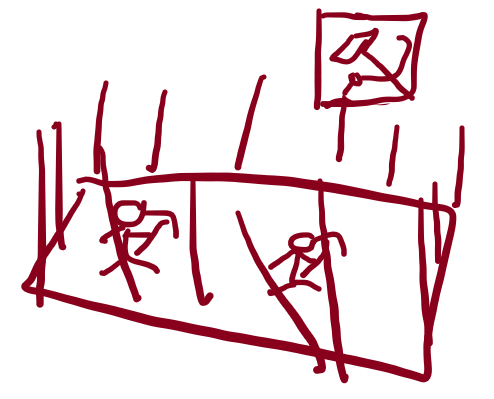
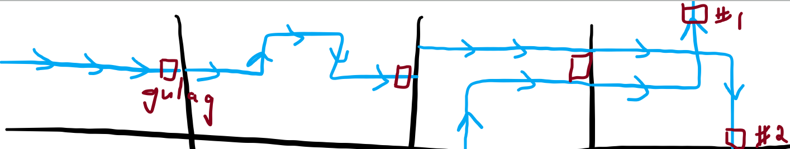
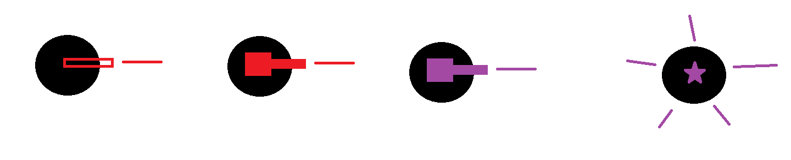
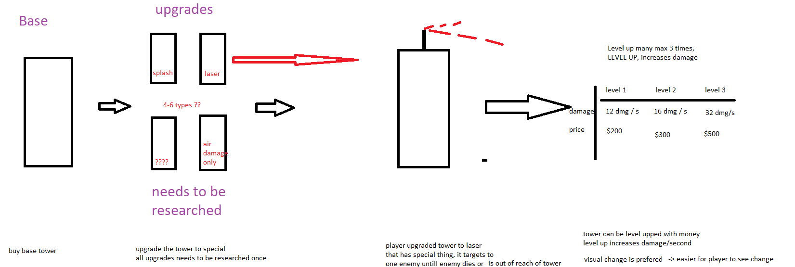
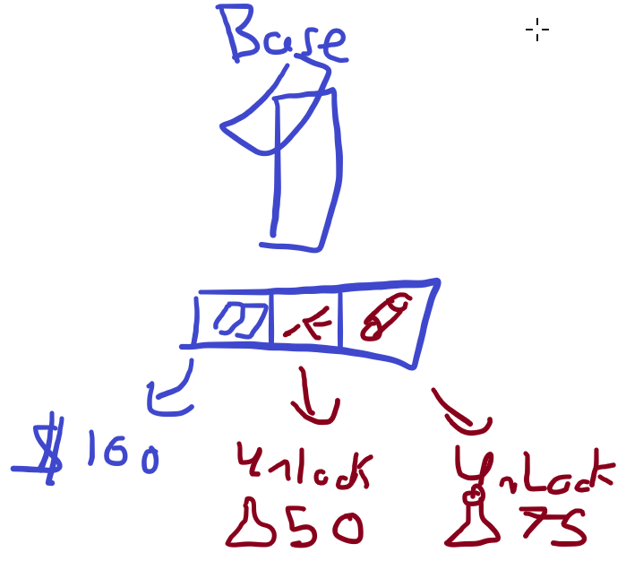

# Meeting 2

---

## Details

Scheduled Time: 04/09/2022 0700 [UTC]

Meeting Time: 04/09/2022 0700-0830 [UTC]

Attendance: Alchemist, Gamerssassin, Jeb, Jems, Krzysztof, Mihett, Yodag, VLYK

---

## Next Meeting

Scheduled Time: 04/09/2022 1700 [UTC]

---

## Agenda

1. Decide on game idea to implement

### Extended

2. Design game
    - Core features
    - Core gameplay loop
    - Initial tasks

---

## Discussion

### Initial brainstorming

-   Going with TD
-   We are the Soviet Union defending from aliens (Vodka + AK47)
-   Map manually made
-   Enemies on path (fixed)
-   Enemies colliding with towers = dead tower (Recommend against?)
-   (Special?) Resource Gathering - YES, GULAGS
-   Currency for building towers
    -   Money
    -   Special Resources? (Communist Points) Used to upgrade towers/buy upgrades/research new towers
-   Game Name: STRAIGHT TO THE RED GULAG?

### Core Gameplay Loop

-   Wave Start -> Kill enemies -> Get Gold -> Buy/Upgrade towers -> Wave End
-   Wave End -> Get Research -> Spend Research to unlock upgrades -> Upgrade towers

### Core Features

-   Tower Defense Game
-   [Currency](../Resource.md)
    -   Type
        -   Gold
        -   Research
    -   Carries over to next wave
    -   Obtained at wave completion
-   [Enemies](../Enemy.md)
    -   All follow path
        -   Spawn point
        -   Path
        -   Termination point
    -   Armor Type: Light, Heavy
    -   Type: Land / Flying / Boss
    -   Speed: High, Regular, Low
    -   Health: High, Regular, Low
    -   Rewards Gold on defeat
-   Map
    -   Whole map fits the screen (720p, windowed, scalable)
    -   Semi auto gen spawn/end points?
    -   Top down perspective
-   Research
    -   Bought with Research
    -   Unlocks tower type
-   Theme
    -   Goofy / Non-serious / Casual
    -   Background: Pink/Red
    -   HQ / Enemy Goal: Gulag + Logo
-   Towers
    -   Build anytime on a grid system
    -   Can't be placed on paths
    -   Bought and upgraded with gold coins
    -   Base Tower
        -   Generalist
    -   Special Tower
        -   Splash dmg type
        -   Focused dmg type (laser)
        -   Antiair dmg type
        -   Frost dmg type (slows enemies down)
        -   Support (reduce fire cooldown, increase range)
    -   Attributes
        -   Attack Damage
        -   Attack Speed
        -   Splash Damage
        -   Antiair Damage
        -   Range

### Optional Features

-   Enemies
    -   Stealth: stealth / non-stealth
-   Events / Special Pickups
    -   Randomly timed
-   Gameplay
    -   Preview next wave? Preview new units only?
-   Theme
    -   Animated foreground
-   Towers
    -   Final upgrade with gold coins + research points
    -   Special Tower
        -   Poison dmg type (DoT)
        -   Support (radar)
    -   Targeting
        -   Nearest
        -   Strongest
        -   Weakest
        -   Air/Ground
        -   Not poisoned/slowed

### Notice to reviewers

-   Look out for delta_time implementation
-   Easily modified

### Images

#### HQ Draft

#### Map Draft

#### Tower Art Draft

#### Tower Draft

#### Tower UI Draft

