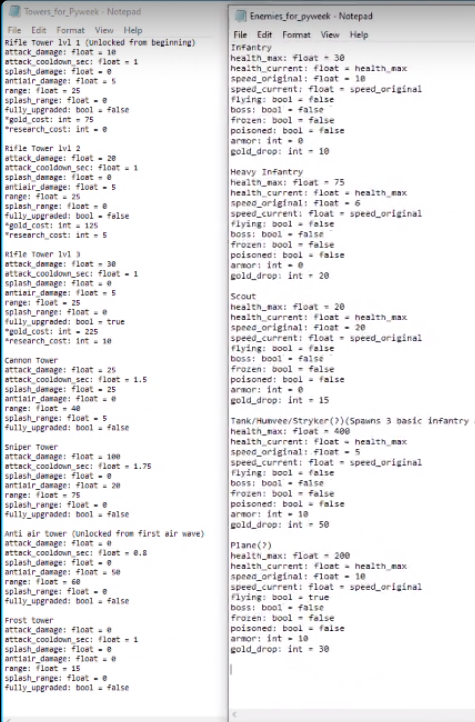
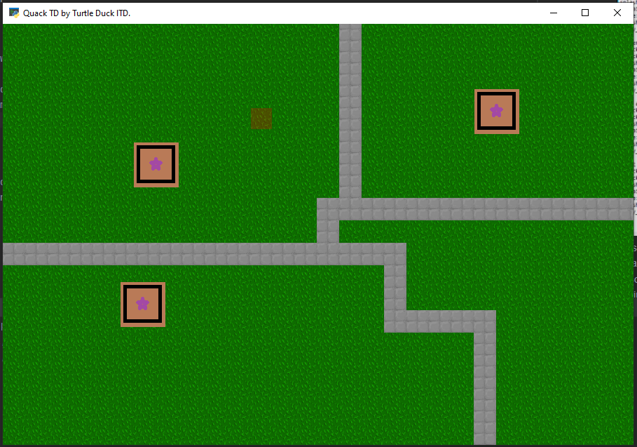

# Meeting 4

---

## Details

Scheduled Time: 05/09/2022 1700 [UTC]

Meeting Time: 05/09/2022 1700-1740 [UTC]

Attendance: Alchemist, Jeb, Jems, Mihett, Yodag

---

## Next Meeting

Scheduled Time: 06/09/2022 1700 [UTC]

---

## Agenda

1. Discuss progress
    - Yodag, Alchemist:
        - Enemy and Tower balance designing
        - 
    - Gamerssassin, VLYK, Jems
        - Arcade setup
        - Resources class
        - Saving Data
    - Jeb, Mihett
        - Tiled demo map
        - Grids
        - Tower class
        - 
    - Kryz
        - probably was working on enemy, no commits yet
2. Assign new tasks
    - Jeb and mihett continue working with towers
    - yodag and Alchemist continue working on balancing and ask more instruction from VLYK

---

## Discussion

-   helped Alchemist to commit changes to git
-   Jeb probably will not be in tomorrow's meeting
